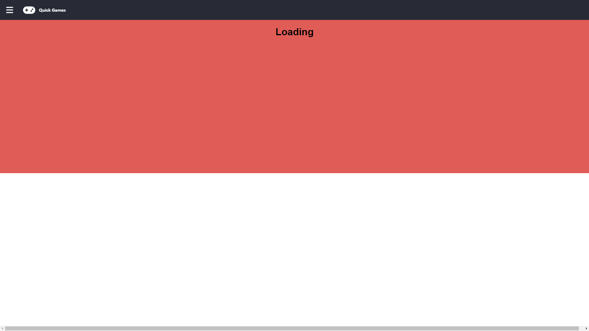

# Quick Games

This project is a Collection of Quick to Play Games that Include TicTacToe, ConnectFour, Reaction Test, and Typing Test: https://jdl-quick-games.web.app/

## Project Details

This project was bootstrapped with React and was deployed with Firebase 
## Preview

## To start development

1. Clone the project
2. Run `npm install`
3. Run `npm run dev` from the root directory

The client will be running on port 3000 by default.

Open http://localhost:3000 to view it in the browser
